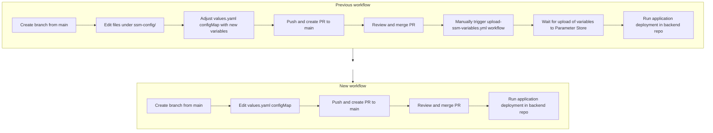

## [2026-01-21]

### Breaking Changes
- **SSM Parameter Store support has been fully removed**: All environment-specific configuration previously managed via AWS SSM Parameter Store and the `ssm-config/` directory is no longer supported. All SSM config YAML files have been deleted.
- **GitHub Actions workflow for SSM upload removed**: The `.github/workflows/upload-ssm-variables.yml` workflow has been deleted. There is no longer any automation for uploading environment variables to SSM.
- **Deployment workflow now only supports AWS Secrets Manager**: The SSM parameter resolution logic in `.github/workflows/trigger-deploy.yml` has been eliminated. Only AWS Secrets Manager is used for runtime secret resolution. Any deployment expecting SSM-based values will fail.
- **Configuration values are now hardcoded in `values.yaml`**: All values previously injected from SSM (e.g., `LIQUIBASE_CONTEXT`, `KMS_ID`, `AI_AUTH_TOKEN_URL`) are now statically set in the respective `values.yaml` configMap sections for each service/environment. Ensure that only non-sensitive, public configuration is present in configMaps. Secrets and credentials must remain in the `secret` section, which publishes to AWS Secrets Manager.

#### Workflow Comparison

### Changed
- Updated documentation and comments in deployment workflow to clarify the removal of SSM support and the exclusive use of AWS Secrets Manager for secret management.

### Removed
- All SSM config YAML files under `ssm-config/` for all services and environments.
- GitHub Actions workflow `.github/workflows/upload-ssm-variables.yml`.
- SSM parameter resolution logic from `.github/workflows/trigger-deploy.yml`.

---
